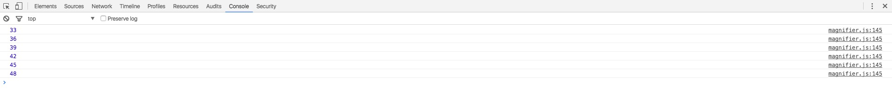

#setInterval函数使用总结(自用)
最近被要求写一个轮播图，针对遇到的问题进行总结，高手请路过，不对的地方也请指正。
##定义和用法
* setInterval() 方法可按照指定的周期（以毫秒计）来调用函数或计算表达式。
* setInterval() 方法会不停地调用函数，直到 clearInterval() 被调用或窗口被关闭。由 setInterval() 返回的 ID 值可用作 clearInterval() 方法的参数。

###代码
	
		(function(){
			var timer = null;
			var num = 10;
			document.getElementById("test").onclick = function (){
				timer = setInterval(function(){
                    	......
                    	num -= 1；
                    	if(num === 0){
                    		clearInterval(timer);
                    	}
                    },1000);
			}
		}());
		
这是一个很常规的setInterval函数用法(我觉得比较简单的用法),我们来变一下.让`timer`在一定条件下执行。

	(function(){
			var timer = null;
			var num = 10;
			var test = 5;
			document.getElementById("test").onclick = function (){
				if(test > 0){
					timer = setInterval(function(){
                    	......
                    	num -= 1；
                    	test -=1;
                    	if(num === 0){
                    		clearInterval(timer);
                    	}
                    },1000);
				}
				
			}
		}());
当`test`大于5时，符合条件，此时如果多次触发`onclick`事件，会发现定时器会全部触发，假如1000毫秒内点击了10000次，1000毫秒后定时器推出，依然在执行`timer`。

我们打印timer看一下结果：
	
我们发现每一次单击触发的定时器其实都是独立的，所以当第一次触发的定时器结束使条件不再符合判断之前，我们可以无限触发定时器。
###解决方案

	(function(){
			var timer = null;
			var num = 10;
			var test = 5;
			var flag = false;
			document.getElementById("test").onclick = function (){
				if(flag){
				return;
				}
				if(test > 0){
					timer = setInterval(function(){
						flag = true;
                    	......
                    	num -= 1；
                    	test -=1;
                    	if(num === 0){
                    		flag = false;
                    		clearInterval(timer);
                    	}
                    },1000);
				}
				
			}
		}());
声明一个全局变量`var flag=false`，在`onclick`事件顶部判断其值，如果为`true`则`return`.定时器触发期间将其值重新赋值为`true`，结束之前再重新赋值为`false`。

至此，此问题得到解决。